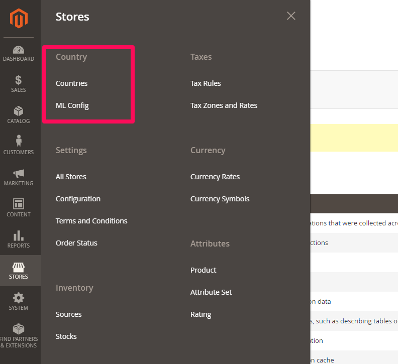
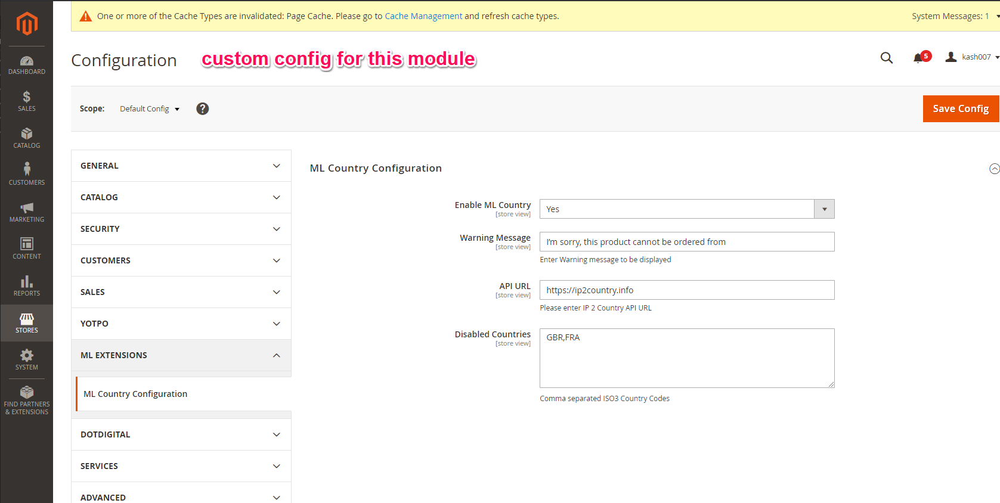
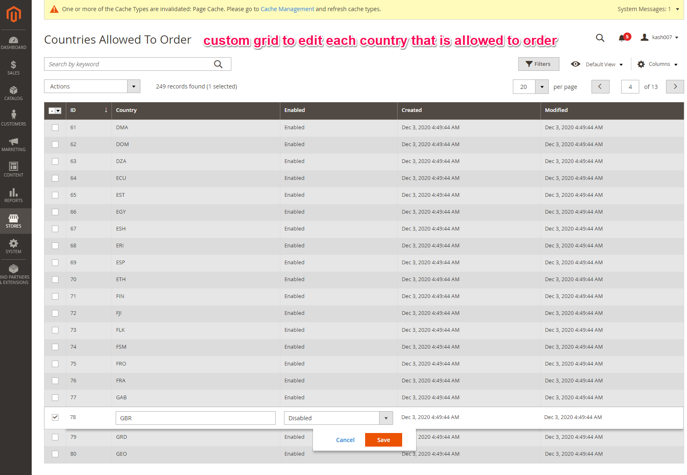

## Kashif Bhatti - Media Lounge Developer Test

Main logic is in ML/DeveloperTest/Observer/CheckCountryBeforeAddToCart.php

#### Assumptions
Quite a big mistake made to store a full list of countries to enable/disable each one to store if you can order from those countries. This was time consuming but shows that I can store the custom table and do inline editing.

#### Approach
Use an Observer for the controller_action_predispatch_checkout_cart_add event.
Then check the if the user's country is invalid from the admin field.
If that's empty, then check the list of countries allowed in the database.
Then set a session to prevent future adds to basket. 

#### Improvements?
Move the Guzzle logic to a separate Model file if I had more time so it can be referenced from other files if needed.